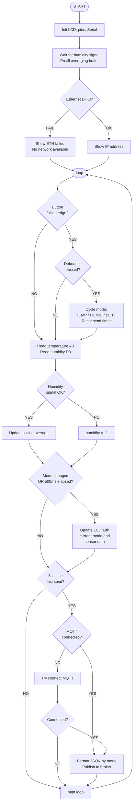

```mermaid
flowchart TD
    START([START]) --> INIT["Init LCD, pins, Serial"]
    INIT --> PREFILL["Wait for humidity signal
    Prefill averaging buffer"]
    PREFILL --> ETH{"Ethernet DHCP"}
    ETH -- FAIL --> ETH_FAIL["Show ETH failed
    No network available"]
    ETH -- OK --> ETH_OK["Show IP address"]
    ETH_FAIL --> LOOP
    ETH_OK --> LOOP

    LOOP(["loop"]) --> BTN{"Button
    falling edge?"}
    BTN -- NO --> SENSORS
    BTN -- YES --> DEBOUNCE{"Debounce
    passed?"}
    DEBOUNCE -- NO --> SENSORS
    DEBOUNCE -- YES --> CYCLE["Cycle mode:
    TEMP / HUMID / BOTH
    Reset send timer"]
    CYCLE --> SENSORS

    SENSORS["Read temperature A0
    Read humidity D3"] --> HUMID_OK{"Humidity
    signal OK?"}
    HUMID_OK -- YES --> AVG["Update sliding average"]
    HUMID_OK -- NO --> NO_SIG["humidity = -1"]
    AVG --> DISP_CHECK
    NO_SIG --> DISP_CHECK

    DISP_CHECK{"Mode changed
    OR 500ms elapsed?"}
    DISP_CHECK -- NO --> MQTT_TIME
    DISP_CHECK -- YES --> UPDATE_LCD["Update LCD with
    current mode and
    sensor data"]

    UPDATE_LCD --> MQTT_TIME{"5s since
    last send?"}
    MQTT_TIME -- NO --> KEEPALIVE
    MQTT_TIME -- YES --> CONNECT{"MQTT
    connected?"}
    CONNECT -- YES --> SEND
    CONNECT -- NO --> TRY_CONNECT["Try connect MQTT"]
    TRY_CONNECT --> CONN_OK{"Connected?"}
    CONN_OK -- NO --> KEEPALIVE
    CONN_OK -- YES --> SEND

    SEND["Format JSON by mode
    Publish to broker"] --> KEEPALIVE

    KEEPALIVE["mqtt.loop"] --> LOOP
```
